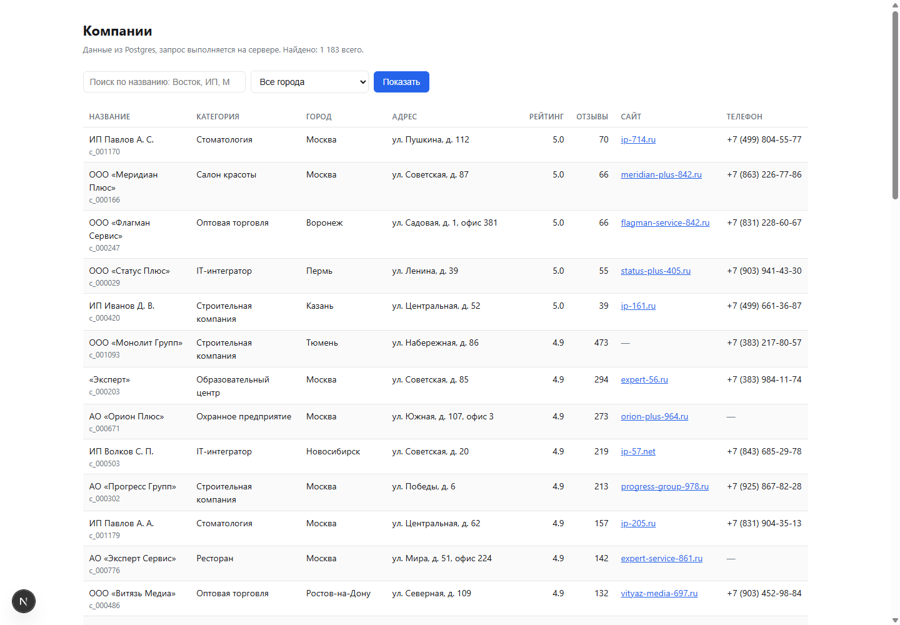
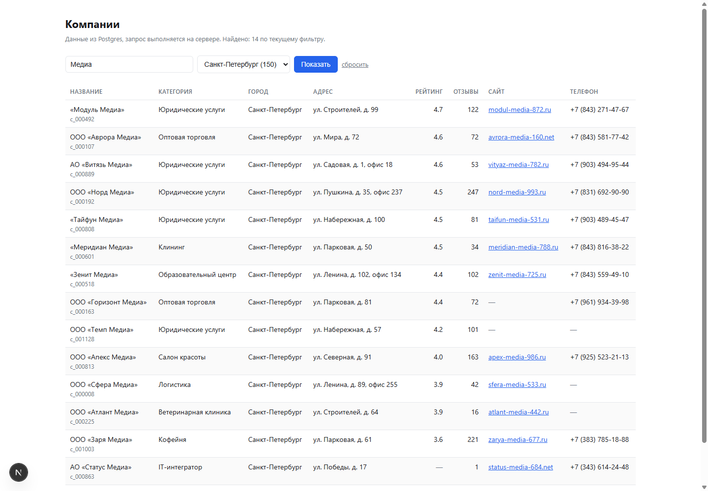
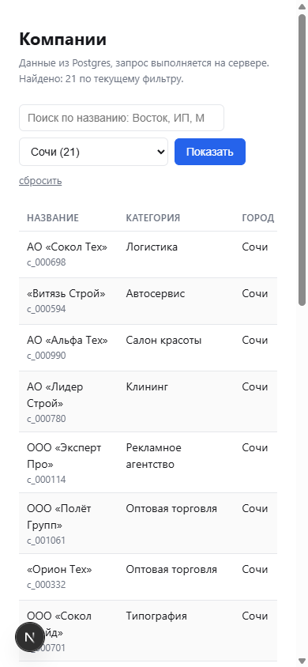

# Тестовое задание Polza Agency — выгрузка → Postgres → страница на Next.js

Стек: TypeScript, Postgres 16, Next.js 15 (App Router), pg. Всё, что не требует зависимости,
сделано без неё: CSV-парсер, загрузка `.env` и нормализация — свои, из внешнего только
`pg` и `iconv-lite` (для ремонта битой кодировки).

## Запуск

Нужны Node 20+ и Docker.

```bash
git clone <этот-репозиторий> && cd polza-test
cp .env.example .env      # обязательно ДО docker compose: пароль базы берётся оттуда
npm install
docker compose up -d --wait   # Postgres 16 на localhost:55432, ждём healthcheck
npm run load:all          # схема + загрузка JSON + загрузка CSV + отчёт
npm run dev               # http://localhost:3000/companies
```

`--wait` не для красоты: без него `docker compose up -d` возвращает управление раньше,
чем Postgres готов принимать подключения, и следующая команда падает на ошибке соединения.

Реальных секретов в репозитории нет: `docker-compose.yml` берёт `POSTGRES_*` из `.env`,
и без `.env` контейнер осознанно не поднимется. В `.env.example` лежат только локальные
демонстрационные реквизиты — они и нужны, чтобы проект поднялся у вас с первой попытки.

`npm run load:all` можно запускать сколько угодно раз — загрузчики идемпотентны,
второй прогон даёт «вставлено 0, обновлено 0» (см. «Проверка» ниже).

Отдельные команды:

| команда | что делает |
|---|---|
| `npm run db:schema` | применить `db/schema.sql` |
| `npm run db:reset` | снести таблицы и создать заново (только для localhost) |
| `npm run load:json` | загрузить `data/page_001…020.json` |
| `npm run load:csv` | загрузить `data/review.csv` |
| `npm run report` | отчёт по данным: статусы, замечания, карантин, дубли |
| `npm run queries` | прогнать три запроса из `db/queries.sql` |
| `npm test` | тесты нормализации и CSV-парсера, без базы |
| `npm run test:db` | проверки на живой базе (внутри транзакции, которая откатывается) |
| `npm run typecheck` | `tsc --noEmit` |

## Что где лежит

```
db/schema.sql        схема: companies, import_runs, import_rows, duplicate_candidates
db/queries.sql       три запроса из задания
scripts/
  load_json.ts       задача 1: постраничная выгрузка API → Postgres
  load_csv.ts        задача 3: review.csv → Postgres, с карантином
  report.ts          короткий отчёт по данным
  run_queries.ts     прогон queries.sql
  reset_db.ts        пересборка локальной базы
  lib/normalize.ts   нормализация и валидация полей (ядро всей чистки)
  lib/csv.ts         разбор CSV по RFC 4180 с номерами строк файла
  lib/store.ts       upsert, журнал прогонов, поиск бизнес-дублей
  normalize.test.ts  тесты нормализации на реальных значениях из выгрузки
  db.check.ts        проверки инвариантов на живой базе
app/companies/       задача 2: страница с поиском и фильтром
data/                выгрузка из задания, положена в репозиторий для воспроизводимости
docs/                скриншоты, живой вывод команд, подробный журнал проверок
ANOMALIES.md         задача 3: что не так с данными и как обнаружено
ANSWERS.md           задача 4: про IDE, модели, тесты и права агента
```

## Схема и почему она такая

Три уровня вместо одного:

- **`import_rows`** — каждая строка каждого файла «как пришла» (`raw jsonb`), с именем файла,
  номером строки, статусом (`applied` / `unchanged` / `duplicate` / `quarantined` / `rejected`)
  и списком замечаний. Любой вопрос к данным превращается в SQL по этой таблице.
  Уточнение, чтобы не вводить в заблуждение: ключ `(source_file, source_row)` уникален,
  то есть это **снимок последнего прогона** по каждой строке, а не полная история —
  после второго запуска статус строки станет `unchanged`. Историю прогонов со счётчиками
  держит `import_runs`.
- **`companies`** — только валидные записи. Ключ — `external_id` (id поставщика).
- **`duplicate_candidates`** — подозрения «одна компания под двумя id», на ручную проверку.
  Загрузчик их не склеивает: слияние необратимо, это решение человека.
- **`import_runs`** — журнал прогонов со счётчиками в `jsonb`.

Ключевые решения:

- **Дедупликация только по `external_id`.** По названию склеивать нельзя: «ООО «Восток Групп»»
  в Уфе и в Москве — разные компании, таких повторов в данных десятки. Бизнес-дубли ищутся
  отдельно — по телефону в E.164 и по паре «нормализованный город + адрес».
- **Пустое значение не затирает непустое.** «Свежая» выгрузка часто беднее исходной;
  потерять из-за неё телефон или сайт нельзя. При обновлении `COALESCE(новое, старое)`.
- **Город хранится дважды:** `city` — как в источнике, `city_key` — канонический.
  Фильтр и все агрегаты работают по `city_key`, поэтому `Москва` / `москва` / `Москва ` /
  `Moscow` — это один город. Не опознанный город остаётся `NULL`, а не выдумывается.
- **Неизвестное значение — `NULL`, а не `0`,** и для рейтинга, и для числа отзывов.
  Иначе средний рейтинг по городу занижается, а «0 отзывов» становится утверждением,
  которого в данных нет. Второе следствие: пока «неизвестно» кодировалось нулём,
  правило «пустое не затирает непустое» на `reviews_count` не работало — мусор в свежей
  выгрузке обнулил бы существующий счётчик. В схеме `CHECK (rating BETWEEN 0 AND 5)`
  и `CHECK (reviews_count >= 0)`.
- **Индексы под конкретные запросы:** `city_key`, `category`, `rating`, `reviews_count`,
  GIN-триграммный индекс по `name` (поиск идёт как `ILIKE '%…%'`, обычный btree тут бесполезен),
  плюс `phone_e164` и `(city_key, address)` — под поиск дублей.

## Страница `/companies`

Server Component: SQL выполняется на сервере, строка подключения в браузер не уходит,
`pg` в клиентский бандл не попадает. `dynamic = 'force-dynamic'`, иначе Next закеширует
страницу и поиск будет отдавать вчерашний результат.

- поиск по названию — `ILIKE`, параметром; `%` и `_` в пользовательском вводе экранируются
  (иначе запрос «%» вернул бы всю базу);
- фильтр по городу — по `city_key`, список городов со счётчиками тянется из базы;
- сортировка детерминированная (`rating DESC NULLS LAST, reviews_count DESC, external_id`) —
  без этого пагинация показывает одни и те же компании на разных страницах;
- пагинация по 50; `?page=99999` прижимается к последней странице, а не даёт пустоту;
- на узком экране таблица скроллится внутри своего контейнера, страница по горизонтали
  не разъезжается.

### Как это выглядит

Список без фильтров — 1183 компании, поиск и фильтр по городу со счётчиками:



Поиск «Медиа» с фильтром по Санкт-Петербургу. В списке есть «ООО «Темп Медиа»»
(`c_001128`) — в CSV эта запись лежала с битой кодировкой, как
`РћРћРћ «Темп Медиа»`. То, что она находится по слову «Медиа» и стоит
в правильном городе, и есть проверка, что ремонт кодировки настоящий:



390 px: страница по горизонтали не разъезжается, таблица скроллится внутри себя:



## Как я это проверял

Загрузчики запускал по два раза и сравнивал результат: первый прогон даёт 994 записи
из API и 189 из CSV, второй — «вставлено 0, обновлено 0», то есть повтор ничего не портит.
Ломалось по дороге дважды: команды из README падали на подключении, потому что
`docker compose up -d` отдаёт управление раньше, чем Postgres готов принимать соединения
(вылечил флагом `--wait`), а запрос «доля компаний с сайтом по категориям» выдавал
категорию «Пермь», пока строка со съехавшими колонками не уехала в карантин.
Страницу сверял с базой напрямую: поиск «Восток» по Москве вернул одну компанию, я решил,
что это баг фильтра, выполнил то же условие в psql — там тоже одна. Поиск ломал специально:
`%`, `_`, `' OR 1=1 --`, `?page=99999`, несуществующий город — ничего не упало,
а `%` и `_` дают ноль совпадений, значит экранирование работает; мобильную вёрстку проверял
замерами DOM, а не скриншотом: на 390 px горизонтального выезда нет, таблица скроллится
внутри своего контейнера. Отдельно проверил, что это работает не только в dev: `npm run build`
проходит, `/companies` в отчёте сборки помечен как динамический маршрут, и на `npm start`
те же запросы дают те же результаты.

Подробный журнал со всеми цифрами и найденными по ходу ошибками —
`docs/как-проверял-подробно.md`. Живой вывод команд — `docs/run-output.txt`
и `docs/report-output.txt`, оба сняты с чистой базы.

## Что осталось за рамками

- **Тесты есть только на ядро** — нормализация, CSV-парсер и два инварианта загрузки
  на живой базе. Не покрыты страница `/companies` (её я проверял руками, см. выше)
  и сквозной прогон загрузчиков в CI.
- **Валидации email нет, потому что нет самого поля** — подробно в `ANOMALIES.md`, п. 10.
- **Шесть компаний, отсутствующих в выгрузке API** (п. 2 в `ANOMALIES.md`), восстановить
  из этих файлов нельзя — нужна перекачка с сортировкой по `id`.
